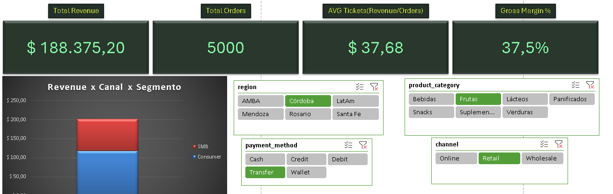
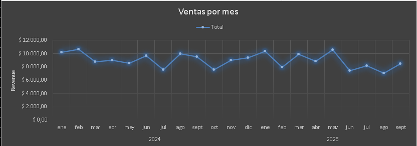
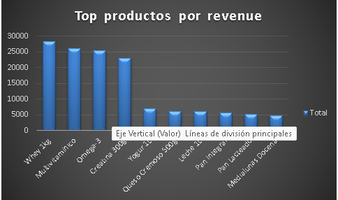
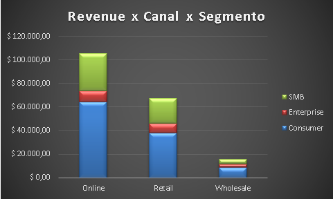

# Dashboard de Ventas — Excel (Proyecto 1)
**Rol:** Data/BI Analyst · **Herramientas:** Excel (Tablas, Pivots, Slicers, Gráficos)

## Problema
Monitorear ingresos, margen, ticket y mix por canal/producto para decisiones comerciales.

## Dataset
Sintético (~5.000 filas) generado para demostración.
Columnas: fecha, canal, región/ciudad, categoría, producto, unidades, precio, descuento, revenue, costo, margen, medio de pago.

## Proceso
- Tabla **Sales** limpia para pivots.
- Pivots:
  - Ventas por Mes (tendencia)
  - Top Productos (ranking)
  - Canal × Segmento (mix)
- Slicers: channel, region, product_category, payment_method
- KPIs: Revenue, Orders únicos, Units, Avg Ticket, Margin %

## Capturas

## Entregables
- [`/data/proyecto1_ventas_retail.csv`](data/proyecto1_ventas_retail.csv)
- [`/excel/proyecto1_excel_ventas.xlsx`](excel/proyecto1_excel_ventas.xlsx)
- Imágenes: `overview.png`, `ventas_mes.png`, `top_productos.png`, `revenue_canal_segmento.png` (ubicadas en `/images/`)

